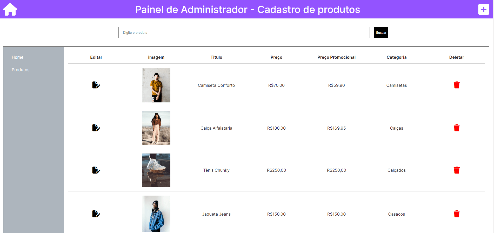

# QMARKª - LOJINHA II - Construção de Site Comercial para Aprendizagem de Pensamento Computacional.
Projeto desenvolvido sobre Front End sobre um e-commerce e aprofundamento em diversas tecnologias.

| :placard: Vitrine.Dev |     |
| -------------  | --- |
| :sparkles: Nome        | **QMARKª A LOJINHA II**
| :label: Tecnologias | javascript, html e css
| :rocket: URL         | [https://www.qmarka.com.br](https://profrenatopereira.github.io/lojinha2/)
| :fire: Desafio     | [https://url-do-desafio.com.br](https://www.alura.com.br/challenges/front-end-7?utm_source=ActiveCampaign&utm_medium=email&utm_content=%5BChallenge+Front-End%5D++FIRSTNAME+%2C+bora+para+um+novo+desafio%3F+%F0%9F%91%8A&utm_campaign=%5BCHALLENGE%5D%28Front-end+7a+ed+%29+Divulga%C3%A7%C3%A3o+para+base+de+alunos+da+escola&vgo_ee=0k%2Bxw2j%2FZFC1wp46o2FTBv2kIo%2BuZA4KL7tx6jhwgyIK7o8RpoSnSpuQRw%3D%3D%3ALBaA17PvTKj0qx397KVhGmlfHWgQYVJO)

<!-- Inserir imagem com a #vitrinedev ao final do link -->

## Detalhes do projeto

Durante o desenvolvimento do projeto diversos métodos foram aplicados para aprimorar e aperfeiçoar o resultado esperado. O site foi desenvolvido usando as tecnologias HTML5, CSS3 e Javascript, sempre pensando na melhor leitura do site por softwares auxiliares e até mesmo para indexação do conteúdo apresentado, tendo o escopo todo devidamente separado por suas tags.

Sempre focado em Mobile First desde a primeira até a última página, o HTML foi construído para 3 formatos de tela, sendo 375px (Mobile), 768px (Tablet) e 1440px (Desktop) mas se apresenta muito bem em qualquer formato inclusive mantendo as proporções na elasticidade, totalmente responsivo. Todo o modelo foi seguido de acordo com o design disposto no [Figma](https://www.figma.com/file/2TLgt8UjsWUViWlmpXu5Fz/Challenge-Front-end-%7C-Loja-Meteora?type=design&node-id=2386-2430&mode=design&t=CMZ5bXDVMWlqhG5E-0) e trabalhado semana a semana usando o método Kanban seguindo o desafio disposto no [Trello](https://trello.com/b/8stNxpRc/challenge-front-end-semana-1).

Todo conteúdo da página é disposto dinamicamente por meio de uma (Fake) Rest API que foi mockada com o uso do [json-server](https://www.npmjs.com/package/json-server), dando a possibilidade ao usuário de acessar a página extra de administrador para adicionar, editar ou excluir um produto na loja, o que atualiza dinamicamente a lista de produtos a serem exibidos, por meio das rotas GET, POST, PATCH e DELETE.

Para conferir a página de administrador, [clique aqui](https://alura-challenge-front-end-2.vercel.app/admin.html). Por padrão os 6 primeiros produtos foram travados para garantir uma boa usabilidade do site, logo, estes não podem ser editados nem deletados.
